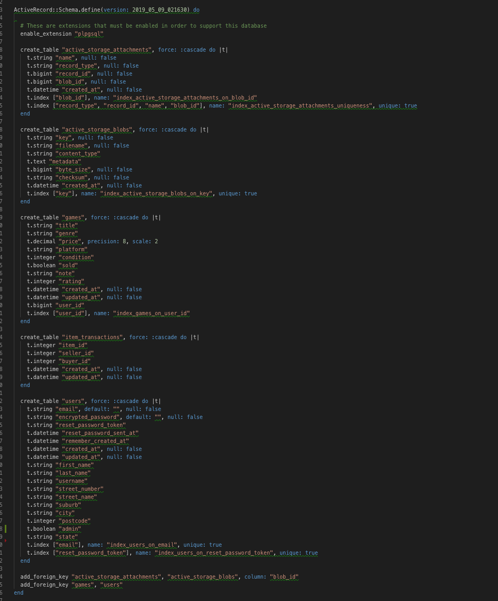
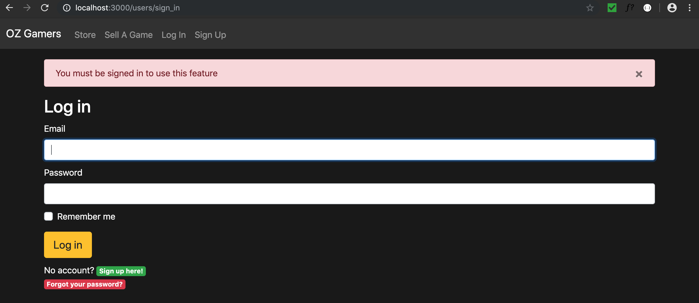

# **README**

# **LINKS**
[Oz Gamers Heroku-App Link](https://arcane-mesa-61390.herokuapp.com/)

[Oz Gamers Web Domain Link](https://ozgamers.shop/)

[Oz Gamers Trello Link](https://trello.com/b/PafDlHIB/rails-project)

[Oz Gamers Figma Link](https://www.figma.com/file/UnUAJkv8s5xzLsTCD5iIa9BZ/Rails-Project?node-id=6%3A246)
# **GITHUB RESPOSITORY**
[Oz Gamers GITHUB Repository Link](https://github.com/timwaldron/rails-project)
# **Description of the project**
### Problem Definition/Purpose
---

**Problems**

We are building a two-marketplace game store app because many online stores do not check the seller items. It will also cause a lot of inconvenience to the buyer and the seller. Majority of online game stores does not provide free shipping to both the seller and the buyer. The third problem is that the seller does not get a better deal when selling their games in store.

**Purpose**

The purpose of this game store app is to provide quality check before the item gets sent to the purchaser.   Also providing free shipping to the buyer and the seller, so that the seller does not need to mark up the price to their game to cover the shipping cost. It also allows the seller to sell their game for a better price than most stores can offer, which also allows the buyers to get a better deal.

### Functionaility/Features
---
* Our app is created by using Ruby on Rails and deployed on Heroku.
* Implemented a devise gem in our app so users can log-in, log-out, sign-up, recover password, edit thier personal details and delete their account.
* Implemented a CanCan gem in our app so users only access certain pages.
* Implemented a Stripe(gem) payment processing system in our app so users pay with credit/debit card.
* Implemented a Mailgun gem in our app to allow users(buyer and seller) to be emailed about their recent transaction.
* Implemented image upload capability on our app using AWS, to allow users to upload their game images.
* Users can create, edit, view and delete their game listing. Users can view their purchase/sold histories and view other users games listing.

### Screenshots
---
#### Index page

#### Sign up form

#### Create a game listing form

#### User listing

#### Game listing

#### User Profile Form

#### User Transaction History

#### Stripe Payment

### Tech stack
---
* HTML
* CSS
* Bootstrap - extended styling
* Javascript
* Amazon S3 - AWS - image-upload
* Stripe - Payment Processing System
* Mailgun - Mailing System
* Devise - Authentication System
* CanCan - Authorization System
* Heroku - deployment platform
* VS Code
* Ruby on Rails
* Ruby
* Postgres SQL

### Instructions to use our App
---
1. Open your terminal and also make sure your Postgres SQL is running. 
2. Find the file called rails-project, then type **cd rails-project** in your terminal and press **enter**.
3. Then type **code .** in the terminal to open VS code.
4. Once VS code is open, first delete the **Gemfile.lock** file and then type **bundle install** from the VS code terminal.
5. After it finishes installing type **rails db:migrate** in the VS code terminal to create a new database migration.
6. Then type **rails db:seed** in the terminal(VS).
7. After it finish seeding data to the database, type **rails s** in the terminal to run the server.
8. Copy and paste this **localhost:3000** to your favourite browser and now you should be able to see our app. Enjoy :)

# **Design Documentation**

### Design process
---
[**Oz Gamers Figma Link**](https://www.figma.com/file/UnUAJkv8s5xzLsTCD5iIa9BZ/Rails-Project?node-id=6%3A246)

### User stories
---
To be a member user must click **Sign Up** allocated in the navbar. If the user is using mobile click the hamburger menu on the right-hand corner and then click the **Sign-Up**. Both will have this green border-top when the user hovers over the Sign Up word.

Once the user click the **Sign Up**, the user enters details and then click **sign up**.

When the user signs up successfully, there will more features on the navbar. First, the user will be able to sell a game, only if the user logged in otherwise user will get an error notification. Once the user have clicked sell a game. Enter some details of a game user want to sell, then click **create**.

After user click create, there will be a flash message that shows **Your Game was successfully created**. 

User can click **My Listings** on the navbar and it will show the user the games the user is selling.

On user listings page, user can click on view game. Once the user have clicked on view game, it will show all the details about that game and the time it was posted and edited. In this page, the user will have the ability to click **edit listing** which user can edit your game if the user has made a mistake and also the ability to click **delete** to delete the game (it removes the game from user listing).

If a user want to edit the game, click edit. It will take the user to take a different page to edit user game. There will a message that the user cannot edit the price, so the user needs to **_contact the admin via email_**. 

Once the user has finished editing user game user must click the update button. It will then display a message **Your game listing has been successfully updated**, Note user also have the ability to close the message by clicking the **X** button. 

The user also have the ability to update user account by clicking the **Profile** from the navbar/hamburger(for mobile). Once the user has finish editing click **Update** so user profile can be updated.

User can delete their account located under the Update button of Edit Details, just by clicking on the **Cancel my account**. It will then ask the user if they want to delete the account, press **ok**.

User can view their transaction history by clicking **History** on the navbar. On this page, a user has the ability to click **Purchased Items** to show a list of their purchase history and the ability to click **Sold Items** to show a list of user sold items.

User can log out by clicking **Log Out** located in the navbar. Once a user has clicked it will show a message **Signed out successfully**

For User to log back in click **Log In**. The log in page will ask them to enter there email and password. (picture of log-If the user have forgotten their password, user can click **Forgot your password**. Once clicked user must enter their email and click **Send me reset password instruction** to be able to log in. 

Finally the best for last. When user click **Store** user will have a full listing of games on sale from all different users. 

If the user wants to buy the game, the user must click **View Listing** of that game. Once clicked User must click the **Purchase for $$$ button** and enter their credit card details (powered by stripe) and then click **Pay**. 

Once clicked paid it will show **Thanks, you paid $amount**. And if the user clicks **History** it will show their current transaction.

### Workflow diagram
---

### Wireframe
---

### Database Enitity Relationship Diagrams
---

# **Details of planning process**

### Project Plan & Timeline
---

### Screenshots of Trello boards
---
#### 29th April

#### 2th May

#### 9th May

#### 10th May

# **Short Answer**

1. **_What is the need (i.e. challenge) that you will be addressing in your project?_**
---
People who want to buy games can buy it at a lower price using our website. When the seller sends the item, that item will be sent to us, which we do a quality check on the item before it gets sent to the purchaser. The seller can sell their game for a better price than most store offers. Our app will provide free shipping satchel to the seller rather than the seller to pay for the shipping to send the postage. Also providing express shipping to buyers for free.

---

2. **_Identify the problem you’re trying to solve by building this particular marketplace App? Why is it a problem that needs solving?_**
---
The first problem - there are only a few online gaming stores that check the seller product. These problems need to be solved because if the seller sends a faulty product( eg. lots of scratches on the disk) to the buyer. The buyer will ask for a refund which causes a lot of inconvenience to the buyer and the seller.

Second problem - not enough online gaming store provides free satchel shipping for the seller. This will make the seller price their game at a higher price to cover the shipping cost. Buyers may lose interest to purchase that game. The third problem - the seller does not get a better deal when selling their games in store. For example, if you purchase the latest game that cost $60 and in a months time you want to sell it in the store you might be lucky to get more than $30.  

---
3. **_Describe the project will you be conducting and how. your App will address the needs._**
---
We’re creating a gaming store app. That allows the seller to sell their games at a good price compared to other gaming markets out there. Furthermore, we will provide a quality check before the item gets sent to the purchaser. We also provide free fast shipping to the buyer and free shipping to the seller, so the seller does not need to mark up the price for the game to cover their shipping cost. Furthermore, a hardcore gamer that likes to clock the game fast will get a better deal when selling their game on our app, it also benefits the buyer because new games being released usually takes more than a month for discounts (between 5 - 10%) on new games.

---
4. **_Describe the network infrastructure the App may be based on._**
---
Since we are creating a gaming web app. For clients to be able to access it. They must have a web browser and for us to show it to our clients on a web browser we use HTTP, allowing communication between web browsers and web servers. Our web server is Puma because it is simple, fast, threaded and highly concurrent HTTP 1.1 server for Ruby/Rack applications in development and production. To deploy, manage and scale our app we use Heroku, thereby our app will be hosted on the Heroku cloud. Also, our database PostgreSQL will be Heroku Postgres when our gaming app is deployed on Heroku. Heroku Postgres has great features that are important for our network infrastructures such as continuous protection, rollback and high availability. In order for clients to store the gaming image on our Heroku web app, we implement Amazon simple storage service (Amazon S3) it’s an object store service. We use Amazon S3 because it provides industry-leading scalability, security, data availability and excellent performance.

---

5. **_Identify and describe the software to be used in your App._**
---
Our App is based on ruby on rails because it is a compulsory requirement for our assessment. Since we only have two weeks to build a web app. Ruby on Rails allows developers to rapidly develop a dynamic web app and web sites. We use Heroku to deploy our app on the cloud because of Heroku supporting development in ruby on rails and our database PostgreSQL. To write our code we use visual studio code(open-source), we also use it for debugging, embedded git control and code refactoring for our app. To create and structure our web pages for our app, we use the coding language called HTML. Furthermore to style and layout the gaming store webpage we use the coding language called CSS. For further styling and responsive mobile design, we used Bootstrap. 

---
6. **_Identify the database to be used in your App and provide a justification for your choice._**
---
Heroku supports PostgreSQL but doesn’t support ruby on rails default database (sqlite3). Also, PostgreSQL is object-relational database and ruby on rails is object-oriented. PostgresSQL has been on active development on the core platform for at least 30 years. PostgreSQL has a strong reputation for its reliability, extensibility, robust features, well-planned architecture and being open source. PostgreSQL is compatible with all major operating systems and has been ACID-compliant since 2001. Since PostgreSQL has been open source for a long time, it is highly extensible. Example, developers can define their own data types, build custom functions and possibly write code from different coding languages without being to compile your database again.
Cost of ownership is very low, it’s also an industry standard and proven to be highly scalable both in the sheer quantity of data it can manage and in the number of concurrent users it accommodates. 

PostgreSQL problems
* a bit harder to google results compared to MySQL(more popular), there aren't as many database administrators with experience managing a Postgres database compared to those with MySQL experience.
* Configuration can be a nightmare.
* Performance issues and less efficient during large bulk operations or read queries
* Memory performance: For every new client connection, PostgreSQL forks a new process. Each new process is allocated about 10MB of memory, which can add up quickly for databases with lots of connections. For simple read-heavy operations, PostgreSQL is typically less performant than other RDBMSs, like MySQL.
*  there are still fewer third-party tools that can help to manage a PostgreSQL database

---
7. **_Identify and describe the production database setup (i.e. postgres instance)._**
---
Our production database setup is called rails-project_production. We are using PostgreSQL. The production one uses PostgreSQL because Heroku uses PostgreSQL (production standard). Our production database has three tables, The user table containing User_ID, User_ID is the primary key, its unique and its autoincrement since each user has a different user_id. The user table also has email, first_name, last_name, date of birth, user_name, street_number, street_name, suburb, postcode, city, state because we need these data for our game store app.

For our clients to be able to sell the game or buy the game we need to create a Game table. The Game table contains Game_id, Game_id being set as the primary key, unique and auto increment because each game on sale is different. The Game table also requires certain data such Title of the game, genre, price (for the seller to set their selling price), platform, condition, note(for the seller to post how great that game is) and rating. Furthermore, the game table has a user_id, the user_id being set as the foreign key and it’s referring to the User table because each game belongs to a user.

In order to keep track of the buyer and the seller, we needed another table in our database, which is called item_transaction. Item_transaction contains Item_id, item_id being set as the primary key, unique and auto increment. Item_transaction also has Timestamp data to show when the seller post their game and when the buyer has purchased the game. Buyer_ID  and Seller_ID are set as Foreign key and it’s referred to the user table to allow us to check who is selling that game or buying game. Game_ID is also included to the item_transaction table, game_id will be a foreign key and being referred to the Game_table.

---
8. **_Describe the architecture of your App._**
---
To create a web app, a basic structure is necessary and that basic structure is MVC, which most web applications are built on.
Model - has all the data and its related logic. It can be represented either the data that is being transferred between the controller and view components or any other logic related data. For our app controller object will retrieve the user information from the database. It manipulates data and send back to the database or use it to render the same data. It responds to the request from the views and also responds to instruction from the controller to update itself.

Views - the part of the application that represents the presentation of data. The gaming store app views are created by the data collected from the model data. It requests the model to give information so it’s able to output information to the user. In our application users can view all the UI components like text, navbar, forms, etc.

Controller - The part of the application that handles user interactions. The controller interprets the inputs from the user, telling the model and view to change when appropriate.

---
9. **_Explain the different high-level components (abstractions) in your App._**
---
For our app, the User controller will handle all the interactions and inputs from view files from devise (change user details, log in, sign out) and view files from user and update the database using the user model. Our Game controller will handle all the interactions and inputs from view files from games ( edit, index, new and show) and update the database using the game and application record model (for the user to able to add/change images).

---
10. **_Detail any third party services that your App will use._**
---
Amazon S3 - an object storage service. Each object is stored as a file with its metadata included and given a unique id number. Using Amazon S3 for the gaming store app allows the user to be able to store the game images on the cloud and also allow other users to see the images on the game sale listing page.

STRIPE - a software that allows individuals and business to make and receive payments over the internet. The good thing about stripe is that stripe is not complicated to set up, stripe offers API integrations so there is no need for internal reporting and it's used by major corporations. Our app uses stripe to allow buyers to pay online.
 
MAIL GUN - a powerful Transactional Email APIs that enable you to send, track and receive an email with minimal effort. Using Mail Gun API for our app notifies the buyer and seller through email about their recent transaction. 

Devise - A common user authentication gem for ruby on rails. We added devise gem to the app to allow the user to sign-in, log-out, edit personal details and delete account securely.

CanCan -  An authorisation gem that restricts what resource a given user is allowed to access. Our App will use this gem to place certain restrictions to the user, the user cannot be able to edit other user game listing.

---
11. **_Describe (in general terms) the data structure of marketplace apps that are similar to your own (e.g. eBay, Airbnb)._**
---
The data structure of the Etsy marketplace is very similar to our Game store App.
Etsy has two distinct user group that provides each other with network benefits. The two distinct users in an Etsy marketplace are buyers and sellers, it has the ability to bring the buyer and the seller together in a convenient way. Thanks to the network effects of the Etsy platform, the buyers have many sellers to choose from, while the seller can have many buyers he or she can service to build their business. The user can be a buyer or a seller or the user can be both. Etsy marketplace requires features that will be used by sellers and buyer. Such as Sign-up/Sign-in via email, Account user setting (name, address, email and change password), user dashboard with notifications.  
Buyers on Esty marketplace are able to search for items, choose quantity and other necessary options, send messages to sellers, leave reviews, add and remove items, place orders, view transaction history. Sellers on Etsy are able to list their items for sale, manage information about the items, communicate with buyers via messages and view transaction history. Although our gaming app does not have all the features that Etsy has for its marketplace, it is still similar to the way that Etsy implements its data structure.

---

12. **_Discuss the database relations to be implemented._**
---
The game store web app user has one-to-many games. Each game belongs to the user because a user can sell many games. In our game table, we included user_id and set it to a foreign key to identifying the relationship between user-table and game-table. Each game has one-to-many images, therefore in our game model, each game has many attached images. For the item_transaction table, item_id has been set to primary key, unique and auto increment because we need to ensure that each transaction is different and unique from the other transactions. The timestamp is included in the item_transaction to give us the actual time when the seller posted the game and also when the buyer purchased the game from the seller. Buyer_ID and Seller_ID are included in the table and has been set to unique and also been set to foreign key (reference table is User and Reference Field is User_ID) because we need to know who bought the game and who sold the game from that transaction.

---
13. **_Describe your project’s models in terms of the relationships (active record associations) they h~ave with each other._**
---
In our game model each game belongs_to the user because we want to set up a one-to-one connection with another model, where each game can be assigned to exactly one user. For the item_transaction table, we need to include Item_ID. To ensure that each transaction is different and unique. The timestamp is also included, to give us the actual time when the seller posted the game and also when the buyer purchased the game from the seller. Game_ID is included in the table because each transaction belongs to a game. Buyer_ID and Seller_ID are included in the table since each buyer belongs to the user_id and each seller belongs to the user_id. Therefore we are able to know who bought the game, who sold the game and what game was purchased. 

---
14. **_Provide your database schema design._**
---

15. **_Provide User stories for your App._**
---

To be a member user must click **Sign Up** allocated in the navbar. If the user is using mobile click the hamburger menu on the right-hand corner and then click the **Sign-Up**. Both will have this green border-top when the user hovers over the Sign Up word.

**Mobile**

**Desktop**

Once the user click the **Sign Up**, the user enters details and then click **sign up**.

When the user signs up successfully, there will more features on the navbar. First, the user will be able to sell a game, only if the user logged in otherwise user will get an error notification.

**Error Notification if not logged in to sell a game**

 Once the user have clicked sell a game. Enter some details of a game user want to sell, then click **create**. After user click create, there will be a flash message that shows **Your Game was successfully created**. 

 

User can click **My Listings** on the navbar and it will show the user the games the user is selling.

 

On user listings page, user can click on view game. Once the user have clicked on view game, it will show all the details about that game and the time it was posted and edited. In this page, the user will have the ability to click **edit listing** which user can edit their game if the user has made a mistake and also the ability to click **delete** to delete the game (it removes the game from user listing).

If a user want to edit the game, click edit. It will take the user to take a different page to edit user game. There will a message that the user cannot edit the price, so the user needs to **_contact the admin via email_**. 

Once the user has finished editing user game user must click the update button. It will then display a message **Your game listing has been successfully updated**, Note user also have the ability to close the message by clicking the **X** button located at the top right of the flash message.

The user also have the ability to update user account by clicking the **Profile** from the navbar/hamburger(for mobile). Once the user has finish editing click **Update** so user profile can be updated.

User can delete their account located under the Update button of Edit Details, just by clicking on the **Cancel my account**. It will then ask the user if they want to delete the account, press **ok**.

User can view their transaction history by clicking **History** on the navbar. On this page, a user has the ability to click **Purchased Items** to show a list of their purchase history and the ability to click **Sold Items** to show a list of user sold items.

User can log out by clicking **Log Out** located in the navbar. Once a user has clicked it will show a message **Signed out successfully**

For User to log back in click **Log In**. The log in page will ask them to enter there email and password. If the user have forgotten their password, user can click **Forgot your password**.

 Once clicked user must enter their email and click **Send me reset password instruction** to be able to log in. 

Finally the best for last. When user click **Store** user will have a full listing of games on sale from all different users. 

If the user wants to buy the game, the user must click **View Listing** of that game. Once clicked User must click the **Purchase for $$$ button** and enter their credit card details (powered by stripe) and then click **Pay**.

Once clicked paid it will show **Thanks, you paid $amount**. And if the user clicks **History** it will show their current transaction.

16. **_Provide Wireframes for your App._**
---

[**Oz Gamers Figma wireframe Link**](https://www.figma.com/file/UnUAJkv8s5xzLsTCD5iIa9BZ/Rails-Project?node-id=6%3A246)

17. **_Describe the way tasks are allocated and tracked in your project._**
---

We allocated the task mostly through in-person discussion and also we create a task in Trello (to do). For each task, we want to do we mostly notify each other in class or through the SLACK. 

18. **_Discuss how Agile methodology is being implemented in your project._**
---

Everyday(weekday) my group has a group discussion with other groups at 10:15 am. To discuss what we have done and what we are going to do to next and also discuss what issues we have.
The type of Agile methodology we are implementing for our project is Kanban. It is a very simple Agile-based, that has prioritised a to-do list. The requirements in Kanban are tracked by their current stage in the process (to-do, in development, in-test, done). When one of us is ready for the next task that person just pull it down from the to-do list. Although Kanban is not time-based, we have a lot of group discussion from 9 to 5, which means we are able to keep track of each other in real time. Also, we have slack for after-hours contact. 

[**Oz Gamers Trello Link**](https://trello.com/b/PafDlHIB/rails-project)

19. **_Provide an overview and description of your Source control process._**
---
[**OZ Gamers GITHUB Repository Link**](https://github.com/timwaldron/rails-project)

Every time one of our team members finishes a Task and wants to push it to Github. They must put their code on a different branch beside the master branch. After they **git add .**, **git commit -m** and **git push origin branch name**. They must do a pull request on the Github website, once they’re able to do that the other team member will check it and confirm it. So it can be able to merge to the master branch for safety reason

**Other team member must approve the request before merging to master**

20. **_Provide an overview and description of your Testing process._**
---

We mainly use rails console to test if all the data is included for each object (user, game and transaction). We also use raise to check if our methods are working correctly and also check if each website page is working correctly (locally and on cloud “Heroku”)from desktop and mobile.  We also check if the third party service (Swipe - User payments, Amazon S3 - user image uploads, Mailgun - user transactions notification via email, Devise - user able to log-in log-out sign-up forgot-password, CanCan - place certain restrictions on user - user cannot edit other user listings) are working correctly on our app. 

21. **_Discuss and analyse requirements related to information system security._**
---

We use CanCan gem for our app to place certain restrictions to the user and guest. Certain restrictions such as user are not authorised to edit other user game listings, the user is not authorised to change the price of their game listings and if they want to they must contact the administrator. Guests are not authorised to access certain web pages such as edit user details, create a new game listing and buying the game. Although guest is allowed to view certain web pages such as the game listing and much more. The good thing about having cancan is that access rule requirements are simple and easy to implement. You can add can? Statements in views and controllers and the guest user logic are simple. The problems with cancan are that it can be hard to keep track of which rules method has been defined for which role, as the ability class will be very messy due to complex requirements are being added. That means it is better to use CanTango which allow programmers to separate rules classes for each role and role group. Therefore for our gaming store app, we only use cancan gem because we want a simple access control system. We also use the Devise gem for our app, so the user can log in and out, sign up. Devise is very secure because it's based on Warden and handles authentication with bcrypt, eliminating the need to hash and salt password manually. The bad thing about Devise is that it does not enforce strong passwords. Overall Devise is a very popular open source gem that has a large community that produces a boatload of useful extension. We also include Stripe gem in our App, Stripe handles our payment processing. Stripe is very secure because it protects the customer from fraud with Radar, Radar is a machine-learning fraud system that can help to differentiate fraudulent and legitimate purchases. The only problem with stripe they may hold the funds or cancel the account without warning if they can determine the business activity to be too risky.

22. **_Discuss methods you will use to protect information and data._**
---

Since our game store app does not store user credit card credential, user can rest assured that credit card credential cannot be stolen because we have a third party service called Stripe. Stripe is a payment processing system, it's an industry-leading developer tool. Stripe is very secure because it protects the customer from fraud with Radar, Radar is a machine-learning fraud system that can help to differentiate fraudulent and legitimate purchases. Stripe offers 24/7 phone and live support. User personal data is protected through a third party gem called Devise. Devise is very secure because it's based on Warden and handles authentication with bcrypt, eliminating the need to hash and salt password manually. In order for the user to not be able to edit other user games listing, we implement CanCan in our App. CanCan places a restriction on users.

23. **_Research what your legal obligations are in relation to handling user data._**
---

In Australia, the business has the responsibility to protect personal information from theft, misuse, interference, loss, unauthorised access, modification, disclosure.
Since our app has Stripe, the user can rest assured that credit card credential cannot be stolen. Therefore we able to protect user personal information from theft, misuse, interference, loss. Our App also has Devise (user authentication system) and CanCan (user restriction system), whereby we are able to protect user personal information from theft, misuse, interference, loss, unauthorised access, modification, disclosure.

Our game store app also has reasonable steps to destroy or de-identify user personal information when it is no longer needed under the Privacy Act 1988. Having a Devise gem in our app, allows User to be able to delete their account. Once deleted all personal information will be destroyed. Hence our app is able to comply with the Privacy Act 1988.

---

## **THE END**
---